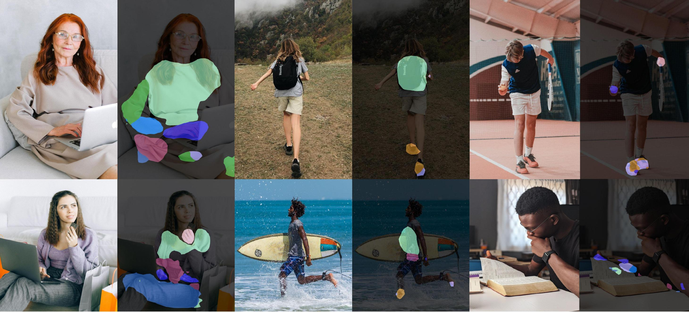

<p align="center">

  <h1 align="center">Detecting Human-Object Contact in Images</h1>
  <p align="center">
    <a href="https://yixchen.github.io/"><strong>Yixin Chen</strong></a>
    ·
    <a href="https://ps.is.mpg.de/person/sdwivedi"><strong>Sai Kumar Dwivedi</strong></a>
    ·
    <a href="https://ps.is.tuebingen.mpg.de/person/black"><strong>Michael J. Black</strong></a>
    ·
    <a href="https://ps.is.mpg.de/~dtzionas"><strong>Dimitrios Tzionas</strong></a>
  </p>
  <h2 align="center">CVPR 2023</h2>
  <div align="center">
    
  </div>

  <p align="left">
    <a href='https://arxiv.org/abs/2303.03373'>
      
    </a>
    <a href='https://hot.is.tue.mpg.de'>
      
    </a>
    <a href='https://hot.is.tue.mpg.de/download.php'>
      
    </a>
    <a href='https://hot.is.tue.mpg.de/download.php'>
      
    </a>
</p>

## News

- [2023/04/19] HOT dataset and model checkpoints are released at the [project website](https://hot.is.tue.mpg.de)!

## Environment
The code is developed under the following configurations.
- Hardware: >=4 GPUs for training, >=1 GPU for testing (set ```[--gpus GPUS]``` accordingly).
- Dependencies: pytorch, numpy, scipy, opencv, yacs, tqdm, etc.

## Installation
```
pip3 install -r requirements.txt
```
The code base is tested under the following pytorch version thats support CUDA capability ```sm_80``` for training.
```
pip3 install torch==1.11.0+cu113 torchvision==0.12.0+cu113 -f https://download.pytorch.org/whl/cu113/torch_stable.html
```

## Getting Started
- Data: download the HOT dataset from the [project website](https://hot.is.tue.mpg.de) and unzip to `/path/to/dataset`. Set `DATASET.root_dataset` as `/path/to/dataset` in the config files in `./config/*.yaml`.
- The split files are located inside `./data` for the `HOT-Annotated ('hot')`, `HOT-Generated ('prox')`, and `Full-Set ('all')`. See [DATA.md](data/DATA.md) for more details.
- The training, validation and testing splits to use during experiments are indicated in the config file `DATASET.list_train(val/test)`.


## Training
```
python train.py --gpus 0,1,2,3 --cfg config/hot-resnet50dilated-c1.yaml
```
To choose which gpus to use, you can either do ```--gpus 0-7```, or ```--gpus 0,2,4,6```. 

`./hot-resnet50dilated-c1.yaml` contains the default training settings for 4-gpu training. The performance and training time may vary for different settings; for example, we can reach slightly better performance when training with larger `imgMaxSize` and smaller `segm_downsampling_rate`.

The validation phase is not included in the training phase currently;see this [issue](https://github.com/CSAILVision/semantic-segmentation-pytorch/issues/55) for more details.

## Evaluation
Evaluate trained models on certain epoch, i.e., `14`. Specify the dataset to be evaluated in ```DATASET.list_val``` in the config file.
```
python3 eval_metric.py --cfg config/hot-resnet50dilated-c1.yaml --epoch 14
```
See evaluation metrics
```
python3 show_loss.py --cfg config/hot-resnet50dilated-c1.yaml
```

## Inference on images from Internet using our trained model 
- Checkpoint: We release our model checkpoints in the [project website](https://hot.is.tue.mpg.de). Download the checkpoints and put them in `./ckpt/hot-c1`.
- Put images in a folder, e.g., `'./demo/test_images'`, and generate the odgt file by
  ```
  python3 demo/gen_test_odgt.py
  ```
- Inference on the images and save visulization results by
  ```
  python3 eval_inference.py --cfg config/hot-resnet50dilated-c1.yaml --epoch 14
  ```

## Citation

```bibtex
@inproceedings{chen2023hot,
  title = {Detecting Human-Object Contact in Images},
  author = {Chen, Yixin and Dwivedi, Sai Kumar and Black, Michael J. and Tzionas, Dimitrios},
  booktitle = {{Proceedings of the IEEE/CVF Conference on Computer Vision and Pattern Recognition (CVPR)}},
  month = {June},
  year = {2023}
}
```

## Acknowledgement
We thank:

- [Chun-Hao Paul Huang](https://paulchhuang.wixsite.com/chhuang) for his valuable help with the [RICH](https://rich.is.tue.mpg.de/) dataset and [BSTRO detector](https://rich.is.tue.mpg.de/)'s training code.
- [Lea Müller](https://is.mpg.de/person/lmueller2), [Mohamed Hassan](https://mohamedhassanmus.github.io/), [Muhammed Kocabas](https://mkocabas.github.io/), [Shashank Tripathi](https://sha2nkt.github.io/), and [Hongwei Yi](https://xyyhw.top/) for insightful discussions.
- [Benjamin Pellkofer](https://is.mpg.de/person/bpellkofer) for website design, IT, and web support.
- [Nicole Overbaugh](https://is.mpg.de/person/noverbaugh) and [Johanna Werminghausen](https://ps.is.mpg.de/person/jwerminghausen) for the administrative help.

This code base is built upon [semantic-segmentation-pytorch](https://github.com/CSAILVision/semantic-segmentation-pytorch) and we thank the authors for their hard work.

This work was supported by the German Federal Ministry of Education and Research (BMBF): Tübingen AI Center, FKZ: 01IS18039B.

## License

This code and model are available for non-commercial scientific research purposes as defined in the [LICENSE](https://hot.is.tue.mpg.de/license.html) file. 
By downloading and using the code and model, you agree to the terms in the [LICENSE](https://hot.is.tue.mpg.de/license.html).

## Contact

For technical questions, please contact ethanchen@g.ucla.edu

For commercial licensing, please contact ps-licensing@tue.mpg.de